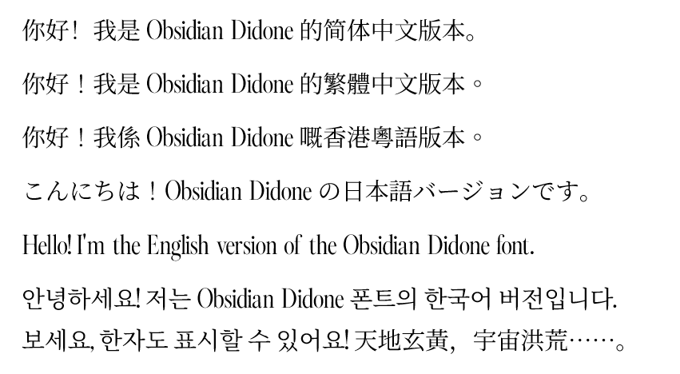

# 🖋️ Obsidian Didone

> **一个将现代 AI 设计美学与经典开源宋体完美融合的多语言衬线字体家族（Serif Font Family）。**

西文（Latin）部分由 **Mixfont AI** 倾力打造，具有高冷、优雅的 Didone 风格；中日韩（CJK）字库部分使用经典的**思源宋体（Source Han Serif / Noto Serif）**进行合并与补全，确保了极高的多语言实用性与排版美感。

---

### 💎 核心设计特性

*   **🌌 西文：高冷 Didone 风格**
    极致的粗细线条对比，垂直分明的字轴。传承自经典 Didot 刻本的优雅风骨，由 AI 进行现代化的视觉修正，极具视觉冲击力。
*   **🌏 中日韩：思源补全**
    采用 Adobe 与 Google 联合开发的思源宋体作为底噪，提供多达数万字的完美 CJK 字形支持，彻底告别中文排版乱码与缺字烦恼。

---

### 📦 字体家族清单 (Font Family)

| 📄 字体文件名 | 🌐 覆盖语种与版本说明 | 💾 文件体积 |
| :--- | :--- | :--- |
| `Obsidian-Didone-Regular.ttf` | **原生西文** (AI 纯享版，不含中文字符) | `~38 KB` |
| `ObsidianDidoneSC-Regular.ttf` | **简体中文** (Simplified Chinese 补全) | `~14.4 MB` |
| `ObsidianDidoneTC-Regular.ttf` | **繁体中文** (Traditional Chinese 台湾标准) | `~15.5 MB` |
| `ObsidianDidoneHK-Regular.ttf` | **繁体中文** (Traditional Chinese 香港标准) | `~15.5 MB` |
| `ObsidianDidoneJP-Regular.ttf` | **日文字体** (Japanese 补全) | `~14.6 MB` |
| `ObsidianDidoneKR-Regular.ttf` | **韩文字体** (Korean 补全) | `~22.7 MB` |

---

### 🎨 字体效果预览 (Preview)

> 💡 **预览**：你可以看下面的预览图，以彰显 Obsidian Didone 的 CJK 多语言能力！

---

### 📜 授权与使用守则 (License)

> 💡 **100% 允许免费商业使用！** 本衍生字体受 **SIL Open Font License 1.1** 开源协议保护。

#### 🟢 允许做的事
*   **全场景商用**：允许在任何商业/非商业设计、印刷、网站内嵌、游戏、APP、视频作品中自由使用。
*   **二次修改分发**：在保持本协议（OFL 1.1）的前提下，允许对其进行二次修改、重命名并再次发布。

#### 🔴 禁止做的事
*   **严禁单独售卖**：你不能把这套字体文件直接打包或者换个名字挂在网上卖钱。
*   **禁止不当闭源**：如果在发布基于本字体的衍生版本时将其闭源，或移除原本的版权声明，将视作侵权行为。

---

Detailed contributor metadata can be verified in the [AUTHORS](AUTHORS) file.

Created with ❤️ by **HinataHikari69**
